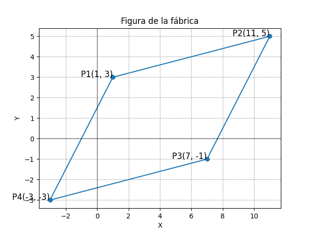

# Proyectos Matemáticos con Matplotlib

Este repositorio contiene dos proyectos matemáticos diferentes utilizando la biblioteca Matplotlib en Python.

## Requisitos

- Python 3.7+
- matplotlib
- matplotlib-venn (para el primer proyecto)

## Instalación

1. Clona el repositorio:

   ```bash
   git clone https://github.com/rolycore/proyectos_matematicos.git
   cd proyectos_matematicos
   ```

2. Crea un entorno virtual (opcional pero recomendado):

   ```bash
   python -m venv venv
   source venv/bin/activate  # En Windows usa `venv\Scripts\activate`
   ```


## Proyectos

### 1. Diagrama de Venn de Etnia, Raza y Cultura

Este proyecto crea un diagrama de Venn de tres conjuntos para visualizar la relación entre etnia, raza y cultura.

#### Código

```python
import matplotlib.pyplot as plt
from matplotlib_venn import venn3

# Definir las etiquetas de los conjuntos
labels = {'100': 'Etnia', 
          '010': 'Raza', 
          '001': 'Cultura', 
          '110': 'Etnia y Raza', 
          '101': 'Etnia y Cultura', 
          '011': 'Raza y Cultura', 
          '111': 'Etnia, Raza y Cultura'}

# Crear el diagrama de Venn
plt.figure(figsize=(10, 8))
venn = venn3(subsets=(1, 1, 1, 1, 1, 1, 1), set_labels=('Etnia', 'Raza', 'Cultura'))

# Añadir las etiquetas a los subconjuntos
for subset in labels:
    venn.get_label_by_id(subset).set_text(labels[subset])

plt.title('Diagrama de Venn de Etnia, Raza y Cultura')
plt.show()
```

#### Ejecución

Guarda el código en un archivo llamado `venn_diagram.py` y ejecuta el siguiente comando:

```bash
python venn_diagram.py
```

### 2. Figura de la Fábrica (Paralelogramo)

Este proyecto dibuja un paralelogramo utilizando puntos definidos en el plano cartesiano.

#### Código

```python
import matplotlib.pyplot as plt

# Definir los puntos
P1 = (1, 3)
P2 = (11, 5)
P3 = (7, -1)
P4 = (-3, -3)

# Crear la figura y el eje
fig, ax = plt.subplots()

# Dibujar el paralelogramo
x_values = [P1[0], P2[0], P3[0], P4[0], P1[0]]
y_values = [P1[1], P2[1], P3[1], P4[1], P1[1]]
ax.plot(x_values, y_values, marker='o')

# Anotar los puntos
ax.text(P1[0], P1[1], 'P1(1, 3)', fontsize=12, ha='right')
ax.text(P2[0], P2[1], 'P2(11, 5)', fontsize=12, ha='right')
ax.text(P3[0], P3[1], 'P3(7, -1)', fontsize=12, ha='right')
ax.text(P4[0], P4[1], 'P4(-3, -3)', fontsize=12, ha='right')

# Configurar los ejes
ax.set_xlabel('X')
ax.set_ylabel('Y')
ax.set_title('Figura de la fábrica')
ax.grid(True)
plt.axhline(0, color='black',linewidth=0.5)
plt.axvline(0, color='black',linewidth=0.5)
plt.grid(color = 'gray', linestyle = '--', linewidth = 0.5)

# Mostrar la gráfica
plt.show()
```

#### Ejecución

Guarda el código en un archivo llamado `parallelogram.py` y ejecuta el siguiente comando:

```bash
python parallelogram.py
```


### Paso a Paso

1. **Genera las Imágenes:**
   Ejecuta tus scripts (`venn_diagram.py` y `parallelogram.py`) para generar las imágenes de salida y toma capturas de pantalla de los gráficos resultantes.

2. **Guarda las Imágenes:**
   Crea una carpeta llamada `images` dentro del directorio de tu proyecto y guarda las capturas de pantalla con nombres descriptivos, por ejemplo, `venn_diagram.png` y `parallelogram.png`.
---

<hr>


<hr>


## Contribuir

Si deseas contribuir a este proyecto, por favor abre un issue o envía un pull request.

## Licencia

Este proyecto está licenciado bajo la Licencia MIT. Consulta el archivo [LICENSE](LICENSE) para más detalles.

## Contacto

Para cualquier consulta o problema, puedes contactarme a través de [shalomsolutiontech@gmail.com](mailto:shalomsolutiontech@gmail.com).

